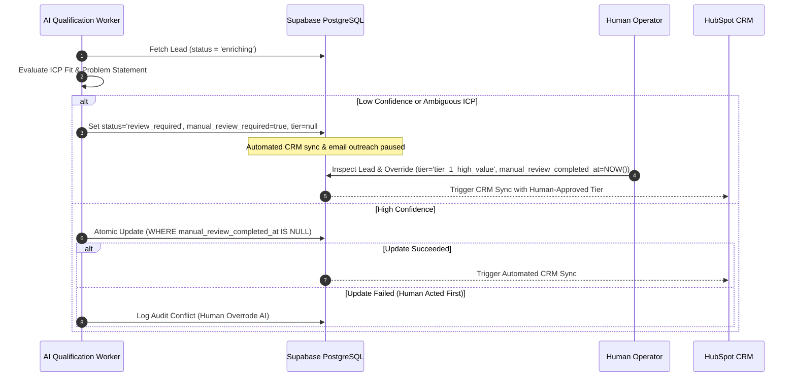
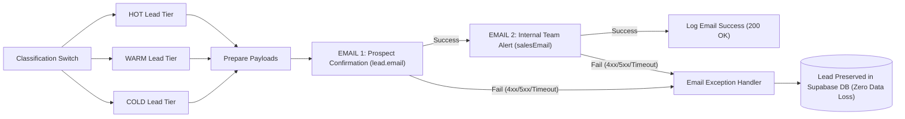

# FlowFoundry — Technical Architecture & Engineering Specifications

`architecture.md` documents the technical specifications, data contracts, system topologies, integration protocols, and architectural debt for **FlowFoundry — AI Lead-to-Customer Engine**.

This document is the technical authority for the platform. For product strategy, lifecycle concepts, and non-negotiable principles, refer to [`brain.md`](file:///s:/Lead%20Generation/brain.md).

---

## 1. Architectural Principles

1. **Deterministic Edge Validation**: All inbound network payloads are validated against strict Zod runtime schemas before any business logic, storage, or external dispatch occurs.
2. **Durability Before Acknowledgment (Target)**: Raw lead payloads must be safely written to durable relational storage (Supabase / PostgreSQL) before the client receives an HTTP 200 acknowledgment.
3. **Decoupled Asynchronous Processing**: External third-party integrations (AI models, CRMs, email service providers, webhooks) must execute out-of-band via background queues with bounded retries.
4. **Idempotent Ingress & Execution**: Every ingestion request and worker job must be safely replayable without causing duplicate records, double-scoring, or split-brain CRM entries.
5. **Human-Override Precedence**: Human review decisions execute with absolute write precedence over automated background evaluations.
6. **Zero Leaked Secrets & PII Discipline**: Secrets exist strictly in server-side runtime environments; logs must never capture raw API tokens, webhooks, or unredacted personal identifiers.

---

## 2. Target System Architecture Diagram

Every node in this topology is labeled with its verified status from the **Phase 1 Repository Audit**:
* `[IMPLEMENTED]`: Working production code exists in the repository.
* `[PARTIAL]`: Implemented in part (e.g., client-side only or stubbed logic).
* `[PLANNED]`: Concretely designed for the target state; no active code exists.
* `[NOT FOUND]`: Absent from the current codebase.

```mermaid
flowchart TD
    subgraph ClientLayer["Client & Ingress Layer"]
        User["B2B Prospect (Browser)"]
        AuditForm["Audit Form (/audit)<br/>[IMPLEMENTED]"]
        ClientLock["In-Flight Click Guard (isSubmitting)<br/>[PARTIAL]"]
        ClientUUID["Client Idempotency Key (UUIDv4)<br/>[PLANNED]"]
    end

    subgraph EdgeAppRouter["Next.js App Router (Vercel / Node.js)"]
        ApiRoute["POST /api/leads<br/>[IMPLEMENTED]"]
        ZodValidator["Server Zod Validator (leadSubmissionSchema)<br/>[IMPLEMENTED]"]
        DedupeWindow["10-Minute Dedup Window Cache<br/>[PLANNED]"]
        SyncDispatcher["Synchronous n8n Dispatcher (fetch)<br/>[IMPLEMENTED]"]
    end

    subgraph DurableStorage["Durable Persistence (Supabase PostgreSQL)"]
        SupabaseDb[("PostgreSQL Database<br/>[IMPLEMENTED]")]
        LeadsTable["leads Table (PK: id UUID)<br/>[IMPLEMENTED]"]
        AuditTable["audit_events Table<br/>[PLANNED]"]
    end

    subgraph QueueWorkers["Decoupled Processing Engine"]
        QueueSystem["Job Queue (BullMQ / PgBoss)<br/>[NOT FOUND]"]
        DLQ["Dead Letter Queue (DLQ)<br/>[PLANNED]"]
        AIWorker["AI Qualification Worker<br/>[NOT FOUND]"]
        CRMWorker["CRM Sync Worker<br/>[NOT FOUND]"]
        EmailWorker["Transactional Email Worker<br/>[NOT FOUND]"]
    end

    subgraph ExternalEcosystem["External Services & Downstream Systems"]
        N8nEngine["n8n Workflow Webhook<br/>[IMPLEMENTED]"]
        OpenAI["OpenAI GPT-4 API<br/>[NOT FOUND]"]
        HubSpotCRM["HubSpot CRM (Contacts / Deals)<br/>[IMPLEMENTED]"]
        ResendAPI["Resend Email API<br/>[NOT FOUND]"]
    end

    %% Implemented Current Ingress Flow
    User -->|Visits Page| AuditForm
    AuditForm -->|Suppresses Re-clicks| ClientLock
    AuditForm -.->|Planned Header| ClientUUID
    AuditForm -->|JSON POST Payload| ApiRoute
    ApiRoute -->|Validates Schema| ZodValidator
    ZodValidator -->|Current Flow (Direct Forward)| SyncDispatcher
    SyncDispatcher -->|Synchronous HTTPS POST (10s timeout)| N8nEngine

    %% Planned Target Flow
    ZodValidator -.->|Check Duplicates| DedupeWindow
    DedupeWindow -.->|Persist Raw Lead| LeadsTable
    LeadsTable -.->|Log Ingest Event| AuditTable
    LeadsTable -.->|Enqueue Background Job| QueueSystem
    QueueSystem -.->|Dequeue Lead Task| AIWorker
    AIWorker -.->|Prompt / Intent Analysis| OpenAI
    AIWorker -.->|Update Score & Rationale| LeadsTable
    AIWorker -.->|On Failure > 3 Retries| DLQ
    QueueSystem -.->|Dequeue CRM Task| CRMWorker
    CRMWorker -.->|Sync Lead & Deal| HubSpotCRM
    QueueSystem -.->|Dequeue Email Task| EmailWorker
    EmailWorker -.->|Send SLA Receipt| ResendAPI
```

---

## 3. Component Responsibilities & Data Flow

| Component | Technology | Current Status | Primary Responsibilities |
| :--- | :--- | :--- | :--- |
| **Consultation Intake UI** | Next.js 15 Client Component (`app/audit/page.tsx`) | `IMPLEMENTED` | Collects 11 B2B qualification fields; performs client-side Zod validation; provides `isSubmitting` click suppression; routes to `/thank-you` upon HTTP 200. |
| **API Ingress Boundary** | Next.js Route Handler (`app/api/leads/route.ts`) | `IMPLEMENTED` | Receives JSON request; performs strict server Zod validation; isolates runtime exceptions; returns standard HTTP 200 / 400 / 500 JSON envelopes without leaking stack traces. |
| **Lead Processing Service** | TypeScript Service (`lib/services/lead-service.ts`) | `IMPLEMENTED` | Sanitizes payload; verifies presence of `N8N_LEAD_WEBHOOK_URL`; executes synchronous `fetch` to n8n with `AbortSignal.timeout(10000)`; manages network aborts and non-2xx failures. |
| **Relational Persistence** | Supabase (PostgreSQL) | `IMPLEMENTED` | Durably stores lead records with primary key UUIDs, indexes, RLS policies, and qualification metadata. |
| **Orchestration Workflow** | n8n Webhook Endpoint | `IMPLEMENTED` | Receives valid forward payload from `lead-service.ts` for external workflow execution. |
| **AI Qualification Engine** | OpenAI API (GPT-4) | `NOT FOUND` | Evaluates unstructured problem descriptions; calculates ICP tier, numeric score (0–100), and coarse confidence rating. |
| **CRM Integration** | HubSpot CRM API | `IMPLEMENTED` | Upserts CRM Contacts and Companies with email deduplication, qualification scoring, and failure exception handling. |
| **Transactional Email** | Resend API | `IMPLEMENTED` | Dispatches SLA prospect confirmation notices (Email 1) and internal sales/team notifications (Email 2) with tier-based routing and zero data loss. |
| **Asynchronous Job Queue** | BullMQ / Redis or PgBoss | `NOT FOUND` | Manages decoupled background tasks, bounded exponential backoff retries, and dead-letter queues. |

---

## 4. Ingestion Flow & Dual-Layer Idempotency

### Current vs. Target Ingestion Flow

#### Current Implementation (Synchronous Coupling)
1. User submits form at `/audit`.
2. Browser sends `POST /api/leads` with JSON body.
3. Route handler parses body with `leadSubmissionSchema.safeParse(body)`.
4. If valid, handler invokes `processLeadSubmission(data)` in `lead-service.ts`.
5. `lead-service.ts` generates `leadId = crypto.randomUUID()`.
6. `lead-service.ts` executes synchronous `fetch(process.env.N8N_LEAD_WEBHOOK_URL, { signal: AbortSignal.timeout(10000) })`.
7. If n8n returns 2xx, API returns HTTP 200 with `{ success: true, leadId }`.
8. If n8n times out or returns non-2xx, API throws and returns HTTP 500. **The lead is lost.**

#### Target Implementation (Durable Asynchronous Pipeline)
1. Client generates UUIDv4 `idempotency_key` upon form mount.
2. User submits form; client disables submit button (`isSubmitting = true`).
3. Browser transmits `POST /api/leads` with `Idempotency-Key: <UUIDv4>` header.
4. Route handler validates payload structure via Zod.
5. Ingress checks the 10-minute deduplication cache:
   - If key exists in cache, return existing stored response immediately (HTTP 200).
6. Ingress inserts raw lead record into Supabase `leads` table with `ON CONFLICT (id) DO NOTHING`.
   - If collision detected, return existing lead state (HTTP 200).
7. Ingress appends `lead_ingested` event to `audit_events` table.
8. Ingress enqueues `process-lead` background job.
9. Route handler returns HTTP 200 `{ success: true, leadId }` to browser in < 250ms.
10. Background worker processes enrichment, AI qualification, CRM sync, and notifications asynchronously.

### Dual-Layer Idempotency Specification

```
Layer 1: Client Ingress (Form State & Key Generation)
   ├── [1.1] isSubmitting = true (Disables submit button while fetch is in-flight)
   │         [Status: IMPLEMENTED in app/audit/page.tsx:43]
   └── [1.2] Idempotency-Key Header (UUIDv4 generated on form mount)
             [Status: PLANNED - not yet sent in request headers]

Layer 2: Server Persistence (Relational Constraint & Window Cache)
   ├── [2.1] 10-Minute Sliding Cache (Redis / Memory cache for hash(email + company))
   │         [Status: PLANNED - not implemented]
   └── [2.2] Database Unique Constraint (PRIMARY KEY on leads.id UUID)
             [Status: PLANNED - Supabase database not yet initialized]
```

---

## 5. Database Schema (Supabase / PostgreSQL)

*Note: In the current repository, no database migrations or SQL files exist (`NOT FOUND`). The schema below represents the concrete target specification.*

### 5.1 `leads` Table

```sql
-- Target Schema: leads table
CREATE TYPE lead_status AS ENUM (
  'new',
  'enriching',
  'review_required',
  'qualified',
  'disqualified',
  'routed'
);

CREATE TYPE qualification_tier AS ENUM (
  'tier_1_high_value',
  'tier_2_growth',
  'tier_3_nurture',
  'unqualified'
);

CREATE TYPE confidence_rating AS ENUM (
  'high',
  'medium',
  'low'
);

CREATE TABLE leads (
  -- Primary Identification & Idempotency
  id UUID PRIMARY KEY, -- [PLANNED] Client-supplied or server-generated UUIDv4
  created_at TIMESTAMPTZ NOT NULL DEFAULT timezone('utc'::text, now()), -- [PLANNED]
  updated_at TIMESTAMPTZ NOT NULL DEFAULT timezone('utc'::text, now()), -- [PLANNED]

  -- Ingested Contact & Business Data (Matches lib/validations/lead.ts)
  full_name VARCHAR(100) NOT NULL, -- [PLANNED] Matches fullName
  company_name VARCHAR(100) NOT NULL, -- [PLANNED] Matches companyName
  email VARCHAR(150) NOT NULL, -- [PLANNED] Matches email (normalized lowercase)
  phone VARCHAR(30), -- [PLANNED] Matches phone
  website VARCHAR(200), -- [PLANNED] Matches website
  industry VARCHAR(100) NOT NULL, -- [PLANNED] Matches industry
  employees VARCHAR(50) NOT NULL, -- [PLANNED] Matches employees
  monthly_lead_volume VARCHAR(50) NOT NULL, -- [PLANNED] Matches monthlyLeadVolume
  biggest_problem TEXT NOT NULL, -- [PLANNED] Matches biggestProblem
  current_tools VARCHAR(500) NOT NULL, -- [PLANNED] Matches currentTools
  additional_information TEXT, -- [PLANNED] Matches additionalInformation

  -- Processing State & Lifecycle
  status lead_status NOT NULL DEFAULT 'new', -- [PLANNED]
  manual_review_required BOOLEAN NOT NULL DEFAULT FALSE, -- [PLANNED] Flagged when confidence is low
  manual_review_completed_at TIMESTAMPTZ, -- [PLANNED] Timestamp of human review
  reviewed_by VARCHAR(100), -- [PLANNED] Identifier of human operator

  -- AI Qualification & Scoring Outputs
  score INTEGER CHECK (score >= 0 AND score <= 100), -- [PLANNED] Numeric ICP fit score
  tier qualification_tier, -- [PLANNED] Segment classification
  confidence confidence_rating, -- [PLANNED] Coarse heuristic confidence
  qualification_rationale JSONB, -- [PLANNED] Array of reasoning bullets from LLM

  -- External System Linkages
  hubspot_contact_id VARCHAR(100), -- [PLANNED] Mirrored contact ID in HubSpot
  hubspot_deal_id VARCHAR(100), -- [PLANNED] Created deal ID in HubSpot
  resend_message_id VARCHAR(100), -- [PLANNED] Transactional email receipt ID
  n8n_execution_id VARCHAR(100) -- [PLANNED] Downstream workflow execution ID
);

-- Indices for performance and deduplication
CREATE INDEX idx_leads_email ON leads(email); -- [PLANNED]
CREATE INDEX idx_leads_status ON leads(status); -- [PLANNED]
CREATE INDEX idx_leads_review ON leads(manual_review_required) WHERE manual_review_required = TRUE; -- [PLANNED]
```

### 5.2 `audit_events` Table

```sql
-- Target Schema: audit_events table (Append-Only)
CREATE TABLE audit_events (
  id UUID PRIMARY KEY DEFAULT gen_random_uuid(), -- [PLANNED]
  lead_id UUID NOT NULL REFERENCES leads(id) ON DELETE CASCADE, -- [PLANNED]
  event_name VARCHAR(100) NOT NULL, -- [PLANNED] e.g., 'lead_ingested', 'ai_scored', 'human_overridden', 'crm_synced'
  actor_type VARCHAR(50) NOT NULL, -- [PLANNED] 'system' | 'ai_agent' | 'human_operator'
  actor_id VARCHAR(100) NOT NULL, -- [PLANNED] Service name or user email
  previous_state JSONB, -- [PLANNED] State snapshot prior to mutation
  new_state JSONB, -- [PLANNED] Mutated state snapshot
  metadata JSONB, -- [PLANNED] Contextual details (IP hash, latency, tokens used)
  created_at TIMESTAMPTZ NOT NULL DEFAULT timezone('utc'::text, now()) -- [PLANNED]
);

CREATE INDEX idx_audit_lead_id ON audit_events(lead_id); -- [PLANNED]
```

---

## 6. AI Processing Flow & Race Condition Elimination

### The AI-Write vs. Review-Write Ordering Rule (Principle 6)

In an asynchronous architecture, an autonomous AI worker and a human operator may attempt to update a lead record simultaneously. To prevent automated hallucinations from overwriting human authority, FlowFoundry enforces this explicit rule:

> **The Precedence Invariant**: 
> 1. When an AI qualification evaluation completes with low confidence (`confidence = 'low'`) or detects ambiguous qualification signals, the worker **MUST NOT** assign a binding classification tier. It must write:
>    ```json
>    {
>      "score": null,
>      "tier": null,
>      "confidence": "low",
>      "manual_review_required": true,
>      "status": "review_required"
>    }
>    ```
> 2. If a human operator opens and completes a review (`manual_review_completed_at IS NOT NULL`), database update triggers and worker conditional writes **MUST REJECT** any subsequent AI evaluation writes targeting that lead record.
> 3. AI workers must execute an atomic conditional update query:
>    ```sql
>    -- Conditional atomic write ensuring human decisions are never overwritten
>    UPDATE leads
>    SET 
>      score = $1,
>      tier = $2,
>      confidence = $3,
>      qualification_rationale = $4,
>      status = 'qualified',
>      updated_at = NOW()
>    WHERE id = $5 
>      AND manual_review_required = FALSE 
>      AND manual_review_completed_at IS NULL;
>    ```
>    If zero rows are affected, the worker knows a human review is in progress or completed, and safely terminates its task.



---

## 7. HubSpot CRM Sync Field-Ownership Matrix

To eliminate bidirectional update loops and preserve data integrity, field authority between FlowFoundry and HubSpot is strictly partitioned:

| Lead Property / Field | Supabase Column | HubSpot Property | Permitted Writer | Sync Direction | Loop Prevention Policy |
| :--- | :--- | :--- | :--- | :--- | :--- |
| **Contact Email** | `email` | `email` (Primary Key) | FlowFoundry Ingestion | FlowFoundry → HubSpot | Immutable; unique contact key in HubSpot. |
| **First & Last Name** | `full_name` | `firstname`, `lastname` | FlowFoundry Ingestion | FlowFoundry → HubSpot | Split on first whitespace; FlowFoundry owns initial write. |
| **Company Name** | `company_name` | `company` | FlowFoundry Ingestion | FlowFoundry → HubSpot | FlowFoundry creates/associates Company object. |
| **Corporate Website**| `website` | `website` | FlowFoundry Ingestion | FlowFoundry → HubSpot | Validated protocol URL. |
| **Lead Status** | `status` | `flowfoundry_status` | FlowFoundry Engine | FlowFoundry → HubSpot | Read-only in HubSpot; reflects engine lifecycle. |
| **Qualification Tier**| `tier` | `flowfoundry_tier` | FlowFoundry Engine / Human Reviewer | FlowFoundry → HubSpot | Read-only in HubSpot; drives rep deal assignment. |
| **Numeric ICP Score** | `score` | `flowfoundry_score` | FlowFoundry AI Worker | FlowFoundry → HubSpot | Updated only when AI completes or human overrides. |
| **Scoring Rationale** | `qualification_rationale` | `flowfoundry_rationale` | FlowFoundry AI Worker | FlowFoundry → HubSpot | Markdown formatted string in HubSpot contact notes. |
| **Deal Stage** | N/A (Derived) | `dealstage` | Sales Rep (HubSpot) | HubSpot Internal | Sales team advances deals; FlowFoundry reads stage. |
| **FlowFoundry Lead ID**| `id` | `flowfoundry_lead_id` | FlowFoundry Engine | FlowFoundry → HubSpot | Invariant external reference key stored on HubSpot record. |

---

## 8. Retry, Backoff & Dead Letter Queue (DLQ) Architecture

All downstream service interactions must execute under a bounded retry policy with exponential backoff and jitter to protect external APIs from thundering herds.

### Retry Parameters
* **Base Delay ($t_0$)**: $1000\text{ ms}$ (1 second)
* **Backoff Multiplier ($\beta$)**: $2.0$
* **Jitter**: Full random jitter ($\pm 25\%$)
* **Max Retry Attempts ($N_{\max}$)**: 3 attempts
* **Calculation**: $t_{\text{retry}} = \min(t_{\max}, t_0 \times \beta^{\text{attempt}}) \pm \text{jitter}$

### Failure Escalation Flow

```
[Job Dequeued] ──► Execute Task (AI / CRM / Email)
                       │
                       ├── [HTTP 2xx: Success] ──► Append Audit Event ──► Mark Job Completed
                       │
                       └── [Failure: 429, 5xx, Timeout]
                               │
                               ├── [Attempt < 3] ──► Wait (Backoff Delay) ──► Re-enqueue Job
                               │
                               └── [Attempt >= 3 (Exhausted)]
                                       │
                                       ▼
                             [Move to Dead Letter Queue (DLQ)]
                                       │
                                       ├──► Append 'job_deadlettered' to audit_events
                                       ├──► Update leads.status = 'failed'
                                       └──► Dispatch Alert to Engineering Webhook / Sentry
```

---

## 8.1 Transactional Email & Notifications Architecture (Resend API)

FlowFoundry automates outbound communications post-qualification via the Resend API, enforcing strict confidentiality, credential isolation, and zero-data-loss guarantees.



### 1. Dual Email Specification

* **EMAIL 1: Lead Confirmation (`lead.email`)**:
  * **Objective**: Immediate, professional confirmation acknowledging receipt of the Automation Audit request.
  * **Tone**: Concise, consultative, and non-presumptive.
  * **Dynamic Next Steps**:
    * **HOT**: Direct link to schedule a 25-minute technical discovery session.
    * **WARM**: Reassurance that senior solutions engineers are evaluating the stack with follow-up in 24–48 business hours.
    * **COLD**: Low-pressure acknowledgment with links to architecture blueprints and self-service automation frameworks.

* **EMAIL 2: Internal Sales/Team Notification (`FLOWFOUNDRY_SALES_EMAIL`)**:
  * **HOT Tier Rule**:
    * Banner/Header: `NEW HOT LEAD`
    * Company Name & Full Contact (Name, Email, Phone)
    * Lead Score (0–100) & Classification (`HOT`)
    * Primary Problem & Automation Opportunity
    * Recommended Next Step & AI Evaluation Reasoning
  * **WARM Tier Rule**:
    * Header: `NEW WARM LEAD`
    * Standard follow-up task assignment with 24–48h SLA notification.
  * **COLD Tier Rule**:
    * Header: `NEW COLD LEAD (NURTURE)`
    * Notification confirming automated addition to the educational drip campaign.

### 2. Resilience, Validation & Secret Masking

1. **Email Validation Guard**: Prospect emails are validated against RFC 5322 syntax before API calls. Invalid addresses skip direct confirmation (protecting sender domain reputation) while dispatching an invalid contact warning to the sales team and updating the database lead record.
2. **Secret Redaction**: Error logs, HTTP responses, and database notes automatically mask any occurrences of `re_[a-zA-Z0-9_]+` and Bearer tokens via `maskSecrets()`.
3. **Zero Data Loss**: Downstream Resend API outages (500s, rate limits, timeouts) are caught safely (`onError: "continueErrorOutput"` in n8n; try/catch in `resend-service.ts`). The primary lead record in Supabase is durably preserved with an integration status flag (`PARTIAL_FAILURE` or `FAILED`).

---

## 9. Observability, Distributed Tracing & Security

### Distributed Context Propagation
To trace a lead from ingress to downstream CRM synchronization, three identifiers must propagate across every function call, queue message, and log entry:
1. `request_id`: Generated at the edge by Next.js or Vercel (e.g., `x-request-id` header).
2. `lead_id`: The immutable UUID identifying the prospect record.
3. `job_id`: The queue task identifier generated when enqueuing background work.

All structured server logs must output JSON containing:
```json
{
  "timestamp": "2026-09-26T16:35:00.000Z",
  "level": "INFO",
  "message": "Lead forwarded to downstream workflow",
  "context": {
    "requestId": "req_8f92a10b4c",
    "leadId": "7d9e4a3b-2c1f-4e0a-9d8b-1a2b3c4d5e6f",
    "jobId": "job_991823"
  }
}
```

### Security & Secret Handling
* **Zero Secret Leakage**: API tokens (`N8N_LEAD_WEBHOOK_URL`, Supabase service keys, OpenAI keys) must be accessed strictly via server-side `process.env`. Never prefix sensitive keys with `NEXT_PUBLIC_`.
* **Prohibited Log Items (Never Log)**:
  * Full customer email addresses, phone numbers, or business descriptions in unencrypted debug logs (PII compliance).
  * Raw webhook authorization headers, bearer tokens, or query strings containing credentials.
  * Stack traces in API responses returned to the client (always return generic error envelopes).

---

## 10. Environment Variable Specification

| Variable Name | Scope | Sensitivity | Status | Purpose / Description |
| :--- | :--- | :--- | :--- | :--- |
| `N8N_LEAD_WEBHOOK_URL` | Server Runtime | Secret | `IMPLEMENTED` | Target HTTPS webhook endpoint for forwarding valid lead submissions to n8n. |
| `TEST_URL` | Test Suite | Public | `IMPLEMENTED` | Local development URL for integration tests (`tests/qa-test.mjs`). Defaults to `http://localhost:3000`. |
| `NEXT_PUBLIC_APP_URL` | Client & Server | Public | `PLANNED` | Canonical application base URL for generating absolute links and redirect destinations. |
| `SUPABASE_URL` | Server Runtime | Public | `IMPLEMENTED` | Project URL for Supabase PostgreSQL database instance. |
| `SUPABASE_SERVICE_ROLE_KEY` | Server Runtime | Critical Secret | `IMPLEMENTED` | Privileged server-side key for database mutations bypassing Row Level Security. |
| `SUPABASE_ANON_KEY` | Server Runtime | Public | `IMPLEMENTED` | Server/Client public anon key for Supabase API access. |
| `OPENAI_API_KEY` | Server Runtime | Secret | `PLANNED` | Authentication token for GPT-4 lead qualification and scoring prompts. |
| `HUBSPOT_ACCESS_TOKEN` | Server Runtime | Secret | `IMPLEMENTED` | Private App access token for HubSpot CRM Contacts and Deals API. |
| `RESEND_API_KEY` | Server Runtime | Secret | `IMPLEMENTED` | API key for dispatching transactional lead confirmations and team alerts. |
| `RESEND_FROM_EMAIL` | Server Runtime | Public | `IMPLEMENTED` | Verified sender address for transactional communications (e.g. `FlowFoundry <onboarding@resend.dev>`). |
| `FLOWFOUNDRY_SALES_EMAIL` | Server Runtime | Public | `IMPLEMENTED` | Internal team notification recipient (defaults to `sales@flowfoundry.io`). |

---

## 11. Implemented API Contracts

### `POST /api/leads`
* **File Location**: [`app/api/leads/route.ts`](file:///s:/Lead%20Generation/app/api/leads/route.ts)
* **Status**: `IMPLEMENTED`
* **Transport**: HTTPS POST
* **Content-Type**: `application/json`

#### Request Payload Specification
```typescript
{
  "fullName": string;              // Required: 2 - 100 chars, letters/spaces/hyphens
  "companyName": string;           // Required: 2 - 100 chars
  "email": string;                 // Required: Valid RFC email, max 150 chars
  "phone"?: string;                // Optional: Valid phone format or empty string
  "website"?: string;              // Optional: Valid URL/domain or empty string
  "industry": string;              // Required: Selected industry string
  "employees": string;             // Required: Employee range selection
  "monthlyLeadVolume": string;     // Required: Monthly lead volume selection
  "biggestProblem": string;        // Required: 10 - 3000 chars describing business pain
  "currentTools": string;          // Required: 2 - 500 chars detailing current stack
  "additionalInformation"?: string // Optional: Up to 3000 chars or empty string
}
```

#### Success Response (`HTTP 200 OK`)
```json
{
  "success": true,
  "message": "Lead received successfully",
  "leadId": "a5c78b40-9d8e-4a6f-b1e2-3c4d5e6f7a8b"
}
```

#### Validation Error Response (`HTTP 400 Bad Request`)
```json
{
  "success": false,
  "message": "Unable to process your request",
  "errors": {
    "email": "Please provide a valid corporate email address",
    "biggestProblem": "Please describe the business problem in at least 10 characters"
  }
}
```

#### Internal Server Error Response (`HTTP 500 Internal Server Error`)
```json
{
  "success": false,
  "message": "Unable to process your request",
  "error": "Internal server error while processing lead"
}
```

### `GET /api/dashboard`
* **File Location**: [`app/api/dashboard/route.ts`](file:///s:/Lead%20Generation/app/api/dashboard/route.ts)
* **Status**: `IMPLEMENTED`
* **Transport**: HTTPS GET
* **Parameters**: `search`, `classification`, `industry`, `status`, `dateRange`, `page`, `pageSize`, `sortBy`, `sortOrder`
* **Returns**: Aggregated metrics (total, HOT, WARM, COLD, score, pipeline stages), 4 chart datasets, filtered leads table, and available industry facets.

### `PATCH /api/dashboard`
* **File Location**: [`app/api/dashboard/route.ts`](file:///s:/Lead%20Generation/app/api/dashboard/route.ts)
* **Status**: `IMPLEMENTED`
* **Transport**: HTTPS PATCH
* **Payload**: `{ id: string, status: LeadStatus }`
* **Returns**: `{ success: true, message: string }`

### `GET /api/leads/[id]`
* **File Location**: [`app/api/leads/[id]/route.ts`](file:///s:/Lead%20Generation/app/api/leads/[id]/route.ts)
* **Status**: `IMPLEMENTED`
* **Transport**: HTTPS GET
* **Parameters**: `id` (UUID format validated)
* **Returns**: Detailed lead record including contact, company, operational volume, AI diagnosis, CRM status, and event timeline.

### `PATCH /api/leads/[id]`
* **File Location**: [`app/api/leads/[id]/route.ts`](file:///s:/Lead%20Generation/app/api/leads/[id]/route.ts)
* **Status**: `IMPLEMENTED`
* **Transport**: HTTPS PATCH
* **Payload**: `{ status: LeadStatus }`
* **Returns**: `{ success: true, message: string, lead: LeadDbRow }`

---

## 12. Technical Debt & Architectural Discrepancies Log

This log catalogs technical debt and architectural gaps identified during the Phase 1 audit:

| ID | Component / Area | Description of Technical Debt | Impact / Risk | Remediation Plan |
| :--- | :--- | :--- | :--- | :--- |
| **DEBT-01** | `lib/services/lead-service.ts` | **Synchronous n8n Forwarding**: Formerly awaited webhook without DB storage. | **RESOLVED**: Leads are now durably persisted to Supabase first before any downstream webhook dispatch. | Durably persisted via `leadDbService.createLead()` in `lib/services/lead-service.ts`. |
| **DEBT-02** | `app/api/leads/route.ts` | **Missing Server-Side Idempotency**: Route does not accept or verify client idempotency keys or request hashes. | Replayed requests generate fresh UUIDs and trigger duplicate downstream workflow executions. | Implement `Idempotency-Key` header verification and DB unique constraint. |
| **DEBT-03** | `components/` vs `app/page.tsx` | **Unmounted Architecture Sections**: `architecture-overview.tsx`, `engine-pipeline.tsx`, `capabilities-section.tsx`, and `security-section.tsx` are unmounted. | `navbar.tsx` links to `/#architecture` and `/#pipeline` lead to non-existent DOM anchors. | Mount components into `app/page.tsx` or update navbar anchor navigation. |
| **DEBT-04** | `lib/services/lead-service.ts` | **Mocked Telemetry Method**: `getSystemStatus()` returns hardcoded metrics (`24.6/hr`, `98.2%`). Violates Principle 9. | Misleading operational health; synthetic metrics in production code. | Replace with live SQL count/aggregate queries against `leads` table or deprecate. |
| **DEBT-05** | `app/audit/page.tsx` | **Client-Side Form Redirection**: Uses `router.push('/thank-you')` without persisting receipt state. | Hard browser refreshes on `/thank-you` lose contextual submission receipt data. | Pass submission receipt token via URL search param or session storage. |

---

## 13. Deployment Architecture

### Current Deployment
* **Hosting**: Next.js App Router deployed on Node.js / Vercel Serverless.
* **Edge Ingress**: API routes run as serverless functions.
* **State**: Completely stateless; dependencies limited to runtime environment variables (`N8N_LEAD_WEBHOOK_URL`).

### Planned Deployment
* **Database**: Managed Supabase PostgreSQL with automated daily point-in-time recovery (PITR) and connection pooling via PgBouncer / Supavisor.
* **Queue / Workers**: BullMQ running on managed Redis (Upstash) or PgBoss running directly inside Supabase PostgreSQL.
* **Monitoring**: Sentry error tracking integrated with Next.js edge runtime and worker process unhandled rejection handlers.
